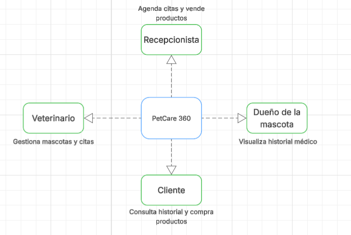
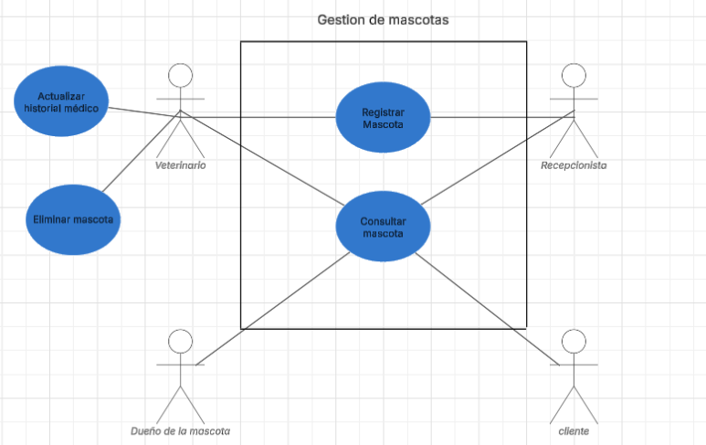
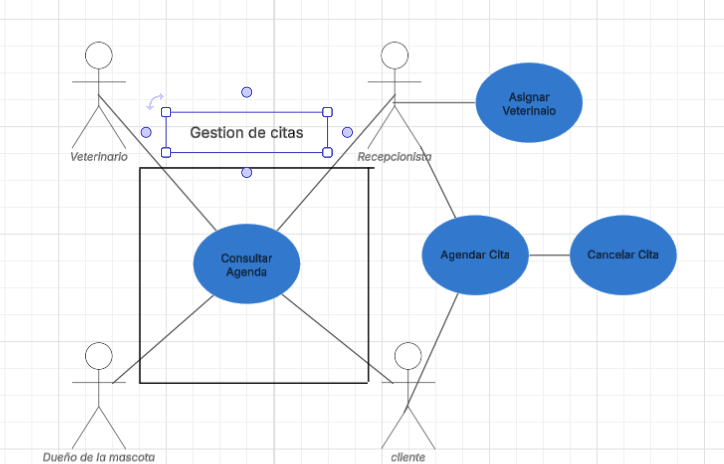
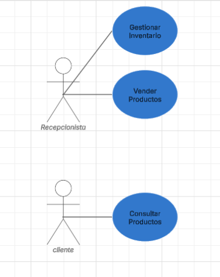

# PetCare 360 - Sistema de Gestión Veterinaria
## Autor: Samuel Leonardo Albarracin Vergara
## Equipo de refuerzo Azul
## Descripción
Sistema integral para la gestión de veterinarias que permite administrar mascotas, citas médicas, venta de productos y facturación electrónica.

## Tecnologías y Dependencias

### Backend
- **Java 17**
- **Spring Boot 3.5.6**
- **Spring Data JPA**
- **mongoDB**
- **Maven** (Gestión de dependencias)

### Testing y Calidad
- **JUnit 5** - Pruebas unitarias
- **Mockito** - Mocking para pruebas
- **JaCoCo** - Cobertura de código
- **SonarQube** - Análisis estático

### Desarrollo
- **Lombok** - Reducción de código boilerplate
- **Swagger/OpenAPI** - Documentación de API
- **H2 Console** - Base de datos en memoria para desarrollo

## Instalación y Configuración

### Prerrequisitos
- Java 17 o superior
- Maven 3.6+
- Git

### Convension de los commits:  
#### Tipos:
- feat:     Nueva funcionalidad
- fix:      Corrección de bug
- docs:     Documentación
- style:    Cambios de formato
- refactor: Refactorización
- test:     Pruebas
- chore:    Tareas de mantenimiento

### Diagramas:
#### Diagrama de contexto:  
  
#### Diagrama de casos de uso:  
- Funcionalidades:
- - Gestion de mascotas: crear, leer, actualizar.
- - Gestión de Citas: agendamiento, tipos de sitas, seguimientos.
- - Ventas e inventario: catálogo, proceso de venta
- - Usuarios y roles: veterinario, recepcionista, administrador, cliente
- Gestión de mascotas:  

- Gestión de citas:  

-  Ventas:  

#### Diagrama de clases preliminar:


### Identificación de patrones de diseño:  
- Factory Method: lo uso ya que encontramos un problema, el cual es que hay diferentes tipos de facturas con lógicas de creación distintas  
para esto se delega la creacion a subclases especializadas, por cada tipo de facturas, lo que permite extender los tipos de factura sin modificar código existente
-  Strategy Pattern: Lo uso, porque encontramos multiples algoritmos de cálculo de precios, para esto encapsulamos cada algoritmo en una clase separada, evitando y reemplazando complejas estructuras de condicionales como if o else.
- Builder: Construccion compleja de objetos con muchos parametros, separa la construccion de la representación, crea objetos complejos paso a paso.

### Principios SOLID:
- S: se cumple con la responsabilidad unica, principalmente gracias a los builder y los factory, quitandole a clases como cliente, como factura, el hecho de tener un constructor por cada tipo de cliente o factura que es.
- O: se cumple con Open/Closed, ya que usamos factory, lo que ayuda a la extensibilidad del codigo, sin afectar a la funcionalidad.
- I: se cumple gracias al uso de interfaces, que definen comportamientos separados.

### Pasos de Instalación
1. Clonar el repositorio:
```bash
git clone https://github.com/petcare360/petcare-system.git
cd petcare-system

