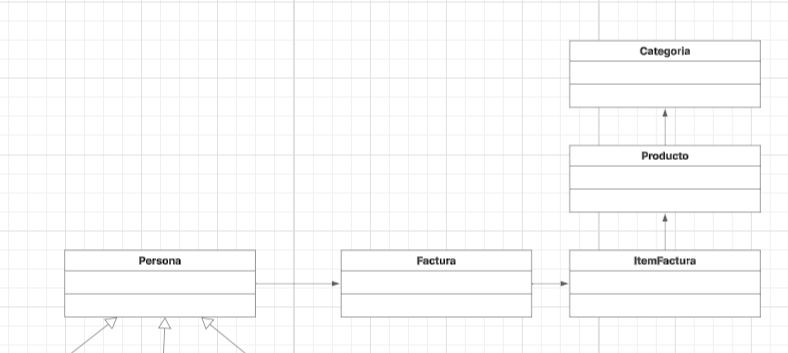
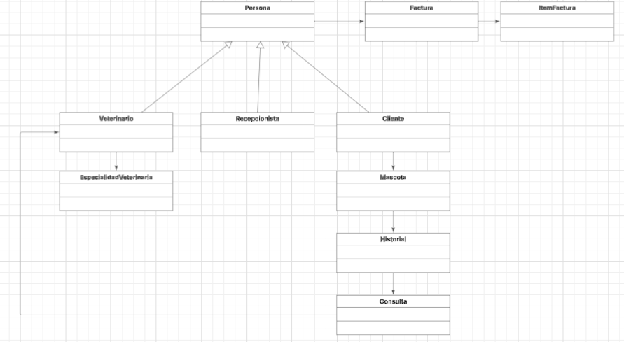

# PetCare 360 - Sistema de Gestión Veterinaria
## Autor: Samuel Leonardo Albarracin Vergara
## Equipo de refuerzo Azul
## Descripción
Sistema integral para la gestión de veterinarias que permite administrar mascotas, citas médicas, venta de productos y facturación electrónica.

## Tecnologías y Dependencias

### Backend
- **Java 17**
- **Spring Boot 3.5.6**
- **Spring Data JPA**
- **mongoDB**
- **Maven** (Gestión de dependencias)

### Testing y Calidad
- **JUnit 5** - Pruebas unitarias
- **Mockito** - Mocking para pruebas
- **JaCoCo** - Cobertura de código
- **SonarQube** - Análisis estático

### Desarrollo
- **Lombok** - Reducción de código boilerplate
- **Swagger/OpenAPI** - Documentación de API
- **H2 Console** - Base de datos en memoria para desarrollo

## Instalación y Configuración

### Prerrequisitos
- Java 17 o superior
- Maven 3.6+
- Git

### Convension de los commits:  
#### Tipos:
- feat:     Nueva funcionalidad
- fix:      Corrección de bug
- docs:     Documentación
- style:    Cambios de formato
- refactor: Refactorización
- test:     Pruebas
- chore:    Tareas de mantenimiento

### Diagramas:
#### Diagrama de contexto:  
  
#### Diagrama de casos de uso:  
- Funcionalidades:
- - Gestion de mascotas: crear, leer, actualizar.
- - Gestión de Citas: agendamiento, tipos de sitas, seguimientos.
- - Ventas e inventario: catálogo, proceso de venta
- - Usuarios y roles: veterinario, recepcionista, administrador, cliente
- Gestión de mascotas:  

- Gestión de citas:  

-  Ventas:  

#### Diagrama de clases preliminar:




### Identificación de patrones de diseño:  
- Factory Method: lo uso ya que encontramos un problema, el cual es que hay diferentes tipos de facturas con lógicas de creación distintas  
para esto se delega la creacion a subclases especializadas, por cada tipo de facturas, lo que permite extender los tipos de factura sin modificar código existente
-  Strategy Pattern: Lo uso, porque encontramos multiples algoritmos de cálculo de precios, para esto encapsulamos cada algoritmo en una clase separada, evitando y reemplazando complejas estructuras de condicionales como if o else.
- Builder: Construccion compleja de objetos con muchos parametros, separa la construccion de la representación, crea objetos complejos paso a paso.

### Principios SOLID:
- S: se cumple con la responsabilidad unica, principalmente gracias a los builder y los factory, quitandole a clases como cliente, como factura, el hecho de tener un constructor por cada tipo de cliente o factura que es.
- O: se cumple con Open/Closed, ya que usamos factory, lo que ayuda a la extensibilidad del codigo, sin afectar a la funcionalidad.
- I: se cumple gracias al uso de interfaces, que definen comportamientos separados.

# Trabajo Semana #2:
### Actualización de Diagramas:
- Por el momento, al manejar una buena estructura inicial de los diagramas, tanto de clases como de casos de uso, se mantendrán iguales, debido a que, la parte de agendar citas, o de administracion de citas, ya se encontraba especificada, ademas, lo que es cliente, veterinario,y mascota, ya se encontraban en el diagrama de clases.
### Creación del API REST de agendar citas:
- Hecho: se puede evidenciar gracias al controller de Citas que cree, se encuentra implementado el post, el delete, y los get que se pidieron en el enunciado, ademas, agregue pruebas para la clase CitaServiceImpl.
### Historias de Usuario

| ID  | Historia de Usuario                                                                                        | Criterios de Aceptación |
|-----|------------------------------------------------------------------------------------------------------------|--------------------------|
| HU1 | Como **dueño**, quiero registrar a mi mascota, para que quede disponible en el sistema.                    | Debe permitir ingresar nombre, tipo y edad. |
| HU2 | Como **dueño**, quiero agendar una cita médica, para que mi mascota reciba atención.                       | La cita debe incluir veterinario, motivo y fecha/hora. |
| HU3 | Como **veterinario**, quiero ver las citas asignadas, para organizar mi agenda.                            | Debe mostrar todas las citas asociadas a un veterinario. |
| HU4 | Como **dueño**, quiero cancelar una cita, para reprogramar en caso de inconvenientes.                      | Debe permitir eliminar la cita y liberar el horario del veterinario. |
| HU5 | Como **veterinario**, quiero evitar tener dos citas al mismo tiempo, para manejar correctamente mi agenda. | El sistema debe validar que no se agenden dos citas con el mismo veterinario a la misma hora. |

### Backlog del Sprint

| Tarea Técnica | Descripción | Estado    |
|----------------|--------------|-----------|
| feature/registrar-mascota | Implementar modelo y endpoint de registro de mascota. | Realizado |
| feature/agendar-cita | Implementar endpoint POST `/citas` con validación de horario. | Realizado |
| feature/consultar-cita | Implementar endpoint GET `/citas/{id}` para obtener detalles. | Realizado |
| feature/cancelar-cita | Implementar endpoint DELETE `/citas/{id}` para cancelar una cita. | REalizado |
| feature/veterinario-citas | Implementar endpoint GET `/veterinarios/{id}/citas` para listar citas asignadas. | Realizado |
| feature/mascota-citas | Implementar endpoint GET `/mascotas/{id}/citas` para listar citas de una mascota. | Realizado |
| feature/test-citas | Crear pruebas unitarias para la capa de servicio (`CitaServiceImpl`). | Realizado |
| feature/readme | Documentar historias de usuario, backlog y endpoints. | Realizado |

### Estructura de ramas:
- En este momento, estoy manejando las ramas como se indica, realicé principalmente, para esta semana, la rama de agendar citas, con esto, se ve como las funcionalidades las realizare en feature/funcionalidad, como lo estamos manejando en el proyecto, ademas de esto, al realizar las funcionalidades, luego se hará merge con develop. hasta que este completo el proyecto, y se pase al main.
### Que siento que me falta?:
- por el momento, se que ando atrasado, en la implementación de swagger y de conectar a la base de datos mongo, esto, lo realizaré para el trabajo de la proxima semana, faltan mas funcionalidades, como indique en un comentario, no se si vaya a realizar un enum del tipo de mascota que hay.
### Pasos de Instalación
1. Clonar el repositorio:
```bash
git clone https://github.com/petcare360/petcare-system.git
cd petcare-system


